# ptracey
P.Shirley's The Rest of Your Life Path Tracer with Assimp and Spectral
Rendering Switch

Docs are available in: https://d-k-e.github.io/ptracey/

This is basically what you get in P. Shirley's awesome
The Rest of Your Life tracer available in
[here](https://raytracing.github.io/books/RayTracingTheRestOfYourLife.html) in
book form.
For the code checkout
[here](https://github.com/RayTracing/raytracing.github.io).

with model loading capabilities of assimp, which is available in 
[here](https://github.com/assimp/assimp/tree/master)

It has couple of extra features as well:

- Very simple multi threaded rendering with c++11 `<future>`.

- Each mesh and model is loaded as `bvh_node`.

- Documentation (well automatically generated by doxygen for now, but I am
  hoping improve it when I have more time)

- Spectral Rendering switch.

## In Progress

- Metropolis Light Transport algorithm for rendering

- Refactoring...

- Other bsdfs.

## Requirements

- Assimp

- c++11+

- cmake 3+

- rapidcsv for reading csv files (included in headers)

- stb for reading images.

## Building 

Just create a build directory in the project.

- `mkdir build`

- `cd build`

- `cmake ..`

## Install

Asset paths are hard coded into code, so stable install location would be good
for the overall project. I have used `bin` folder inside the main directory.

- `mkdir bin`

- Now you can do stuff like `make install` and arrange your assets with
  respect to the install location of your executable which in this case is
  `bin` folder situated at the same level of the `README` file.

## Small Note on Spectral Rendering Switch

Spectral rendering code has been heavily influenced from 
<a href="https://github.com/mmp/pbrt-v3">pbrt</a> especially during conversion
of rgb's to spectrums. It also inherits the idea of having the capacity to
compile code with different rendering switches. 

If you want to turn on, spectral rendering you should comment out the relative
section in `spectrum.hpp`. Once you rendered the image, if you are unsatisfied
with what you have, try changing `xyz2rgb__*` function under
`sampled_spectrum.hpp`, with something else defined in `specutils.hpp`.  If
you are unsatisfied with all of the functions there, try using another matrix
for conversion process. 

You'll see that besides the function `xyz2rgb_pbr` which is the exact same
function used by the pbr source code, all functions are defined in the same
manner. You define a matrix, then multiply it with xyz vector. If you are
interested in doing spectral rendering in c++, you should be able to
understand what is going on in the other functions so much so that you
reproduce them with different values for matrices.

Another side note. Though the code is heavily influenced from pbrt, the
spectral power distribution object defined in `spd.hpp`, has relatively
distinct features. I differ a lot from pbrt in that perspective, for the
better or the worse.

## Screen shots

Here are some eye candy. They are mostly reproductions from P. Shirley's
books.

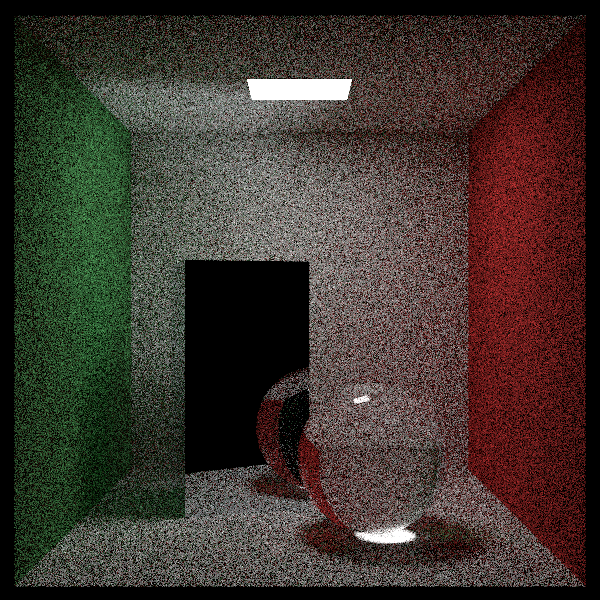
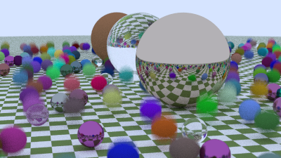
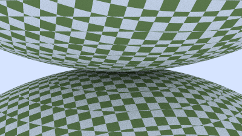
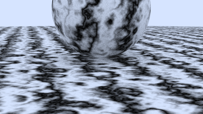
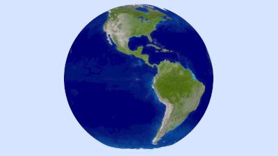
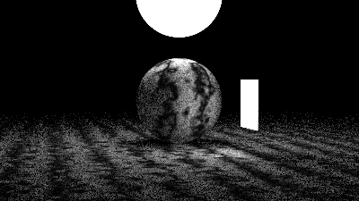

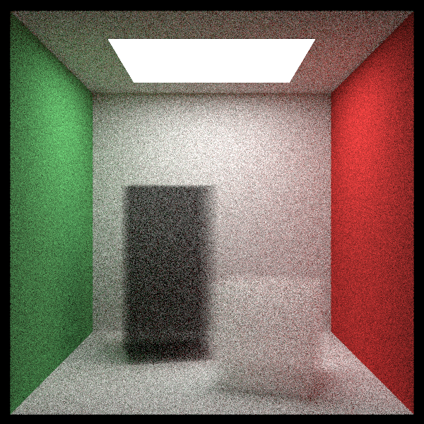

## A Special Hallmark for #RTKitty

The model is made by 
EKA: twitter [`@bakin___`](https://twitter.com/bakin__)

It is traced by PTracey.

- Anger Kitty

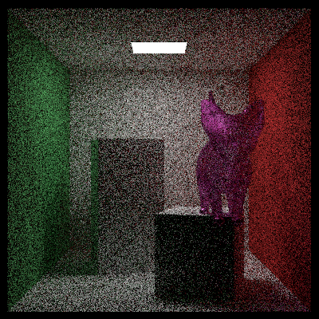

- Glass Kitty

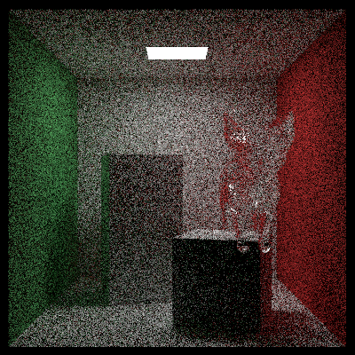

- Invisible Kitty

- Metal Kitty

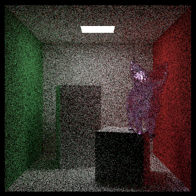

- Night is Yours Kitty

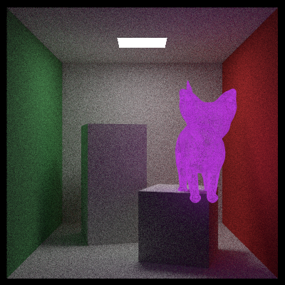

- Glow me Thy Name Kitty 

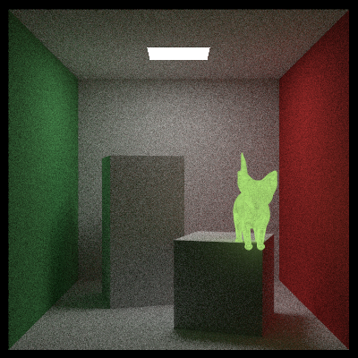
