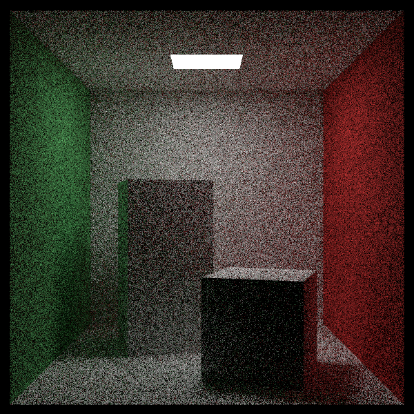

# ptracey
P.Shirley's The Rest of Your Life Path Tracer with Assimp

Docs are available in: https://d-k-e.github.io/ptracey/

This is basically what you get in P. Shirley's awesome
The Rest of Your Life tracer available in
[here](https://raytracing.github.io/books/RayTracingTheRestOfYourLife.html) in
book form.
For the code checkout
[here](https://github.com/RayTracing/raytracing.github.io).

with model loading capabilities of assimp, which is available in 
[here](https://github.com/assimp/assimp/tree/master)

It has couple of extra features as well:

- Very simple multi threaded rendering with c++11 `<future>`.

- Each mesh and model is loaded as `bvh_node`.

- Documentation (well automatically generated by doxygen for now, but I am
  hoping improve it when I have more time)

## In Progress

- Spectral Rendering switch.

## Requirements

- Assimp

- c++11+

- cmake 3+

## Building 

Just create a build directory in the project.

- `mkdir build`

- `cd build`

- `cmake ..`

## Install

Asset paths are hard coded into code, so stable install location would be good
for the overall project. I have used `bin` folder inside the main directory.

- `mkdir bin`

- Now you can do stuff like `make install` and arrange your assets with
  respect to the install location of your executable which in this case is
  `bin` folder situated at the same level of the `README` file.

## Screen shots

Here are some eye candy. They are mostly reproductions from P. Shirley's
books.

## A Special Hallmark for #RTKitty

The model is made by 
EKA: twitter [`@bakin___`](https://twitter.com/bakin__)

It is traced by PTracey.

- Anger Kitty

- Glass Kitty

- Invisible Kitty

- Metal Kitty

- Night is Yours Kitty

- Glow me Thy Name Kitty 

