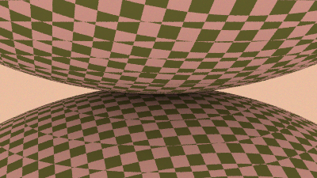
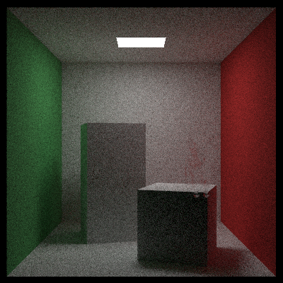

# ptracey
P.Shirley's The Rest of Your Life Path Tracer with Assimp and Spectral
Rendering Switch

Docs are available in: https://d-k-e.github.io/ptracey/

This is basically what you get in P. Shirley's awesome
The Rest of Your Life tracer available in
[here](https://raytracing.github.io/books/RayTracingTheRestOfYourLife.html) in
book form.
For the code checkout
[here](https://github.com/RayTracing/raytracing.github.io).

with model loading capabilities of assimp, which is available in 
[here](https://github.com/assimp/assimp/tree/master)

## Features

- Very simple multi threaded rendering with c++11 `<future>`.

- Each mesh and model is loaded as `bvh_node`.

- Documentation (well automatically generated by doxygen for now, but I am
  hoping improve it when I have more time)

- Spectral Rendering switch.

- Spectral Power Distribution IO in several formats:

  - Json: Dumps spds to a json file as they come out from rendering function.
    The structure of the json file is quite simple. `x` and `y` denote the
    placement of image pixel, `values` is the array whose elements are
    wave length - power value pairs. The first element is the wave length.
    The second element is the power value. The structure of the io object is
    very simple. Checkout `spdio.hpp` for more details.

  - Csv: Dumps spds to a Comma Separated Value (CSV) file. It should be much
    more compact than json.  The structure of the file is quite simple. First
    row is x,y values for pixels. From the second row and below, values under
    the x column are wavelength values, values under y column are power
    values. The separator for the csv file is ','. When the length of two spds
    don't match, we pad the shorter spd with zeros, so that both wavelength
    value and the associated power value would be zero. This should help to
    distinguish padded rows from actual values.

  - Spb: Spectral Binary Format is an acknowledged format by
    [CIE](http://cie.co.at/publications/multispectral-image-formats). Its
    [specification](http://multispectral.org/spb/spb_fileformat.pdf) is really
    simple. The parser I use come from another
    [project](https://github.com/D-K-E/spbparser) of mine. It is a little
    rough around edges, but it gets the job done. However, in order to support
    serialization into .spb we need to resample the image spectra into a more
    homogeneous structure. Since specification of spb requires that each
    spectrum needs to have the same amount of wave length resolution and same
    amount of number of channels (number of channels correspond to number of
    sampled wave lengths, and wave length resolution corresponds to distance
    between each wave, if I understood the specification correctly), we do an
    additional resampling of spectra before passing them to its corresponding
    io object.

## In Progress

- Metropolis Light Transport algorithm for rendering

- Refactoring...

- Other bsdfs.

## Requirements

- Assimp

- c++17+

- cmake 3+

- [rapidcsv](https://github.com/d99kris/rapidcsv/) for reading csv files (included in headers)

- [stb](https://github.com/nothings/stb) for reading images.

- [Json for Modern C++](https://github.com/nlohmann/json) parser 

## Building 

The only dependency that might be problematic is Assimp.  Just set the
absolute path to its shared library to AssimpSOPath variable in CMakeLists.txt
file and proceed regularly that is, once the value of AssimpSOPath is set: 

- `mkdir build`

- `cd build`

- `cmake ..`

## Install

Asset paths are hard coded into code, so stable install location would be good
for the overall project. I have used `bin` folder inside the main directory.

- `mkdir bin`

- Now you can do stuff like `make install` and arrange your assets with
  respect to the install location of your executable which in this case is
  `bin` folder situated at the same level of the `README` file.

## Small Note on Spectral Rendering Switch

Spectral rendering code has been heavily influenced from 
<a href="https://github.com/mmp/pbrt-v3">pbrt</a> especially during conversion
of rgb's to spectrums. It also inherits the idea of having the capacity to
compile code with different rendering switches. 

If you want to turn on, spectral rendering you should comment out the relative
section in `spectrum.hpp`. Once you rendered the image, if you are unsatisfied
with what you have, try changing `xyz2rgb__*` function under
`sampled_spectrum.hpp`, with something else defined in `specutils.hpp`.  If
you are unsatisfied with all of the functions there, try using another matrix
for conversion process. 

You'll see that besides the function `xyz2rgb_pbr` which is the exact same
function used by the pbr source code, all functions are defined in the same
manner. You define a matrix, then multiply it with xyz vector. If you are
interested in doing spectral rendering in c++, you should be able to
understand what is going on in the other functions so much so that you
reproduce them with different values for matrices.

Another side note. Though the code is heavily influenced from pbrt, the
spectral power distribution object defined in `spd.hpp`, has relatively
distinct features. I differ a lot from pbrt in that perspective, for the
better or the worse.

## Screen shots

Here are some eye candy. They are mostly reproductions from P. Shirley's
books.

Spectral Rendering Output 

## A Special Hallmark for #RTKitty

The model is made by 
EKA: twitter [`@bakin___`](https://twitter.com/bakin__)

It is traced by PTracey.

- Anger Kitty

- Glass Kitty

- Invisible Kitty

- Metal Kitty

- Night is Yours Kitty

- Glow me Thy Name Kitty 

